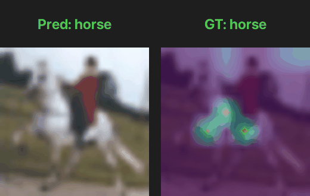

# PointNet from scratch

<div style="display: flex; gap: 5px;">
    <a href="https://arxiv.org/abs/2010.11929">
        
    </a>
</div>

###
Implementing ["An Image is Worth 16x16 Words: Transformers for Image Recognition at Scale"](https://arxiv.org/abs/2010.11929) from scratch.

### Clone and install dependencies
``` 
git clone https://github.com/alessiopiroli/ViT_from_scratch
pip install -r requirements.txt 
```

### Train 
``` 
python train.py vit/config/vit_config.yml
```

### Evaluate 
``` 
python visualize.py vit/config/vit_config.yml
```

### Qualitative Results
> Classification results on the Tiny ImageNet test set. Left: original image, Right: attention map.
>
